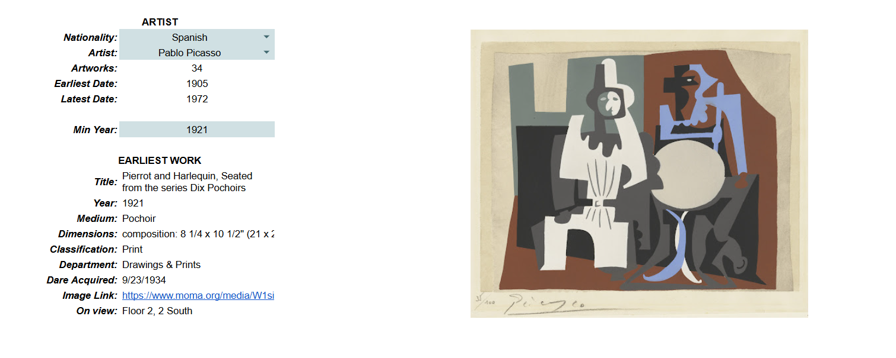

# 🖼️ MoMA Art Explorer

**An interactive Google Sheets project built for The Museum of Modern Art (MoMA), New York City.**

This project creates a data-driven exploration tool that allows curators to dynamically filter and visualize artists' works based on **nationality**, **artist**, and **minimum creation year**.

---

## 🎯 Objectives

1. **Clean & Prepare the Data**  
   - Linked artworks to artists using `XLOOKUP`, `SPLIT`, and `TEXTJOIN`.  
   - Extracted clean year and cleaned OnView field.

2. **Extract Artist Information**  
   - Created dependent dropdowns for Nationality → Artist.  
   - Calculated total artworks, earliest and latest works.

3. **Display Artist Work**  
   - Filtered by Min Year.  
   - Returned details (Title, Medium, Dimensions, Classification, etc.).  
   - Embedded artwork images using the `IMAGE()` function.

---

## 🧠 Tools & Environment

- **Google Sheets**
- **Functions Used:** `XLOOKUP`, `ARRAYFORMULA`, `TEXTJOIN`, `SPLIT`, `FILTER`, `REGEXEXTRACT`, `TRANSPOSE`, `IMAGE`
- **Dataset:** `MoMA_OnView.xlsx`

---

## 🖥️ Output Snapshot

*(Embed or link your dashboard screenshot here)*  

---

## 📊 Key Features

- Interactive dropdowns for nationality and artist  
- Real-time artwork metrics  
- Earliest artwork preview (with embedded image)  
- Cleaned and dynamic dataset linkage  

---

## 🚀 How to Use

1. Open the Google Sheet (link below).  
2. Select a **Nationality** from the first dropdown.  
3. Choose an **Artist** (auto-filtered by nationality).  
4. Enter a **Minimum Year** to explore artworks.  
5. The dashboard auto-updates to show the earliest work with its image and details.

🔗 **[View Google Sheet Demo](https://docs.google.com/spreadsheets/d/1HQSQ3rOQIKDrAG_fdsrBu7JpmwAev6qavkIC376J048/edit?usp=sharing)**

---

